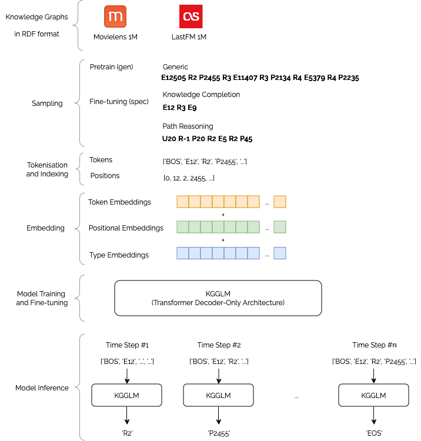

<div align="center">

<!-- [](https://arxiv.org/abs/<id>) -->
[](https://shields.io/)
[](https://shields.io/)


# KGGLM: A Generative Language Model for Generalizable Knowledge Graph Representation Learning in Recommendation
[Giacomo Balloccu](https://giacoballoccu.github.io/), [Ludovico Boratto](https://www.ludovicoboratto.com/), [Gianni Fenu](https://web.unica.it/unica/it/ateneo_s07_ss01.page?contentId=SHD30371), [Mirko Marras](https://www.mirkomarras.com/), [Alessandro Soccol](https://github.com/alessandrosocc)
</div>

<p align="center">
  
</p>


> **Abstract:** *Current recommendation methods based on knowledge graphs rely
on entity and relation representations for several steps along the
pipeline, with knowledge completion and path reasoning being
the most influential. Despite their similarities, the most effective
representation methods for these steps differ, leading to inefficiencies, limited representativeness, and reduced interpretability. In this
paper, we introduce KGGLM, a decoder-only Transformer model
designed for generalizable knowledge representation learning to
support recommendation. The model is trained on generic paths
sampled from the knowledge graph to capture foundational pat-
terns, and then fine-tuned on paths specific of the downstream step
(knowledge completion and path reasoning in our case). Experi-
ments on ML1M and LFM1M show that KGGLM beats twenty-two
baselines in effectiveness under both knowledge completion and
recommendation.*
# Paper
Paper under publication.

# Setup
It is possible to download weights and sampled paths here: [[**Link**](https://shorturl.at/EIZ8T)]

### Steps


Clone the repository
```bash
git clone https://github.com/mirkomarras/kgglm.git
```

Install dependencies
```bash
pip install -r requirements.txt
pip install . # from root folder
```
### Data Mapper
It is mandatory to first run the mapper corresponding to the model in the `helper/data_mappers` folder.

To run:
- NFM, FM, BPRMF, KGAT, CKE, CFKG: `python mapper_kgat.py --dataset <dataset>`
- PGPR, UCPR: `python mapper_rl.py --data ml1m --model pgpr`
- CAFE: `python mapper_cafe.py --data ml1m`
### Sampling training data from datasets
*Take account that sampled paths are already available in the link above.*
```bash
./build_datasets_generic.sh # to pretrain
./build_datasets_rec.sh # to finetune for recommendation
./build_datasets_lp.sh # to finetune for knowledge completion
```
### Training
*Take account that weights are already available in the link above.*

**KGE Baselines on Recommendation**

```bash
CUDA_DEVICE=0 && ./run_kge_experiments_recommendation.sh CUDA_DEVICE
```
**KGE Baselines on Link Prediction**
```bash
CUDA_DEVICE=0 && ./run_kge_experiments_linkprediction.sh CUDA_DEVICE
```


**CKE, KGAT, BPRMF, NFM, MF, CFKG**
```bash
python helper/models/<knowledge_aware|traditional>/<model>/main.py --dataset <dataset>
```
**PGPR**


*It is mandatory to train TransE on the relevant dataset first.*
```bash
python preprocess.py --dataset ml1m
python preprocess_embeddings.py —-dataset lfm1m —-name TransE
python train_agents.py —-epochs 1 -—dataset lfm1m
python gridsearch.py —-dataset lfm1m 
python test_agents.py —-dataset lfm1m —-hidden [hiddenSize taken after gridsearce; e.g. --hidden 128 64]
```

**CAFE**


*It is mandatory to train TransE on the relevant dataset first and then execute `preprocess_embeddings.py` inside the PGPR folder as above*.
```bash
python preprocess_embeddings.py —-dataset ml1m —name TransE
python preprocess.py --dataset ml1m
```


**PLM-Rec**
```bash
python helper/models/lm/PLM/main.py
```

**KGGLM pretraining and finetuning**
```bash
CUDA_DEVICE=0 && ./run_kgglm_experiments.sh CUDA_DEVICE

```
### Evaluation

**Baselines on Recommendation**

```bash
CUDA_DEVICE=0 && ./run_kge_evaluation_recommendation.sh CUDA_DEVICE
```
**Baselines on Link Prediction**

```bash
CUDA_DEVICE=0 && ./run_kge_evaluation_linkprediction.sh CUDA_DEVICE
```

# Data
*The data is already available in the repository, while the paths can be downloaded from the previous link. The paths_random_walk folder must be placed in the folder of the corresponding dataset (e.g. data/lfm1m/paths_random_walk)*.


### Datasets info
|                             | ML1M        | LFM1M      |
|-----------------------------|-------------|------------|
| **Interaction Information** |             |            |
| Users                       | 6,040        | 4,817       |
| Products                    | 2,984        | 12,492      |
| Interactions                | 932,295      | 1,091,275    |
| Density                     | 0.05        | 0.01       |
| **Knowledge Information**   |             |            |
| Entities (Types)            | 13,804 (12)  | 17,492 (5)  |
| Relations (Types)           | 193,089 (11) | 219,084 (4) |
| Sparsity                    | 0.0060      | 0.0035     |
| Avg. Degree Overall         | 28.07       | 25.05      |
| Avg. Degree Products        | 64.86       | 17.53      |

# Results
### Recommendation
**ML1M**
|          | NDCG | MRR  |  Parameters: [Epoch, EmbSize, BatchSize, lr] |
|----------|------|------|-----------------------------------------------|
| TransE   | 0.28 |  0.23  |         [16,100,64,0.0001]            |
| TransH    |  0.26 | 0.20|        [10,100,64,0.0001]              |
| TransD   |  0.23  |  0.18  |        [27,100,256,0.0001]          |
| TransR   |  0.16  |  0.12  |       [2,100,256,0.001]           |
| TorusE  |  0.26  |   0.21   |        [0,100,64,0.0001]                    |
| RotatE  |  0.20  |  0.15 |        [23,100,256,0.0001]       |
| RESCAL  |  0.26  |  0.20  |         [3,100,64,0.0001]               |
| DistMult |  0.28  |  0.22   |        [22,100,64,0.0001]                  |
| ComplEX | 0.26   | 0.21  |  [2,100,64,0.0001]  | 
| TuckER  |  0.27  | 0.22    |         [19,100,256,0.0001]                 |
| Analogy  | 0.26  |  0.21    |[4,100,64,0.0001]         |
| HolE    | 0.24  |  0.19    |      [11,100,64,0.0001]                |
| ConvE   |  0.27  |  0.22   |       [2,200,256,0.0001]                 |
| MostPopular | 0.26| 0.22|  | 
| BPRMF   | 0.29|0.23 | [300, 64,1024,0.0001] | 
| CKE | 0.30 | 0.23 | [120, 64, 1024,0.001] | 
| CFKG   |  0.27  |  0.21    |   [500, 64, 1024, 0.0001]     |
| KGAT   |  0.31  |  0.24   |  [500,64,1024,0.0001]       |
| PGPR   |  0.28 |  0.21   |    [50,512 , 64, 0.0001]     |
| UCPR   |  0.26  |  0.19  |    [40, 64,128,0.0000007]     |
| CAFE   |  0.21  |  0.15  |    [20,200 , 64, 0.1]     |
| PLM   |  0.27  |  0.18    |  [20, 100, 256, 0.0002]       |
| KGGLM (gen-only)   |  0.11  |  0.07 |      [3,768, 256, 0.0002]     |
| KGGLM (gen+spec) |  0.41  |  0.31  |        [2,768, 256, 0.0002]  |

**LFM1M**

|          | NDCG | MRR  |  Parameters: [Epoch, EmbSize, BatchSize, lr] |
|----------|------|------|--------------------------------------------|
| TransE  | 0.12 | 0.10    |    [28,100,64,0.001]                  |
| TransH  |   0.18 | 0.14 |    [22,100,64,0.001]                    |
| TransD  |  0.17 |  0.13  |         [29,100,256,0.0001]               |
| TransR  |   0.15 |  0.11  |            [29,100,256,0.001]                  |
| TorusE  | 0.18   |  0.14  |         [28,100,256,0.0001]            |
| RotatE  | 0.25  |  0.20 |        [29,100,256,0.001]            |
| RESCAL | 0.24  | 0.19    |      [26,100,256,0.001]                     |
| DistMult | 0.30  |   0.25  |      [10,100,256,0.001]                |
| ComplEX |   0.28 | 0.23    |          [29,100,64,0.0001]   |
| TuckER  |   0.12 |  0.10  |         [4,64,64,0.0001]              |
| Analogy |  0.33   |  0.28  |  [27,100,128,0.0001]                                   |
| HolE    |  0.19  | 0.14   |             [29,100,64,0.0001]                 |
| ConvE   |  0.13  |  0.11   |   [2,200,64,0.0001]            |
| MostPopular | 0.12| 0.10| | 
| BPRMF   |0.08 |0.06 | [300, 64,1024,0.0001]| 
| CKE   |  0.33  |  0.27  |  [120, 64, 1024,0.001]       |
| CFKG   |  0.13  |  0.10  |   [500, 64, 1024, 0.0001]                |
| KGAT   |  0.30  |  0.24  |   [120, 64, 1024, 0.001]                 |
| PGPR   |  0.18 |  0.14  |    [50, 512 , 64, 0.0001]               |
| UCPR   |  0.32 |  0.26  |    [40, 64,128,0.0000007]          |
| CAFE   |  0.14  |  0.09  |      [20, 200, 64, 0.1]          |
| PLM   |  0.28  |  0.19  |  [20, 100, 256, 0.0002]               |
| KGGLM (gen-only)    |  0.27  |  0.20 |  [3,768, 256, 0.0002]               |
| KGGLM (gen+spec)  |  0.53  |  0.45 |  [2,768, 256, 0.0002]            |

### Knowledge Completion

**ml1m**
|           | MRR | Hits@1 |  Parameters: [Epoch, EmbSize, BatchSize, lr] |
|----------|------|----|----------------------------------------------|
| TransE |   0.19  |   0.14   |          [23, 100, 64, 0.0001]               |
| TransH  |  0.19   |    0.15    |         [24 ,100 ,64 ,0.0001]             |
| TransD |   0.16  |  0.07      |           [29, 100, 64, 0.0001]              |
| TransR  |   0.13  |  0.06      |           [29 ,64, 128, 0.01]            |
| TorusE |    0.20 |   0.15     |            [17, 100, 64, 0.0001]               |
| RotatE |  0.22   |    0.13   |        [12 ,64, 128, 0.01, 0]               |
| RESCAL  |   0.20  |     0.16   |           [3, 100, 64, 0.0001]              |
| DistMult  |  0.19   |   0.11     |        [29, 100, 64, 0.0001]                  |
| ComplEX  |     0.23 |     0.15   |       [29, 100, 64, 0.0001]                |
| TuckER   |   0.10  |      0.04  |           [26, 100, 256, 0.0001]              |
| Analogy  |   0.20  |    0.13    |        [18, 100, 64, 0.0001]              |
| HolE  | 0.14    |  0.10      |         [24, 100, 64, 0.0001]                |
| ConvE |   0.10  | 0.04       |       [1 ,200 ,64, 0.0001]                |
| KGGLM (gen-only) |   0.38     | 0.29     |    [3,768, 256, 0.0002]              |
| KGGLM (gen+spec)  |   0.39   | 0.30   |    [2,768, 256, 0.0002]           |

**lfm1m**

|                | MRR     | Hits@1        | Parameters: [Epoch, EmbSize, BatchSize, lr] |
|----------|------|-----|---------------------------------------------|
| TransE     |   0.76  |    0.66     |       [21, 100, 64, 0.0001]             |
| TransH  |   0.76  |   0.66         |           [21, 100, 64, 0.0001]         |
| TransD     |  0.31   | 0.01         |           [4, 100, 64, 0.0001]          |
| TransR  | 0.35    |    0.19        |            [18 ,64, 128, 0.01]          |
| TorusE   | 0.79    |    0.69       |          [7, 100, 64, 0.0001]           |
| RotatE    |  0.07   |    0.02      |      [0, 64, 128, 0.01]                 |
| RESCAL     |  0.29   |   0.21          |        [3, 100, 64, 0.0001]               |
| DistMult    |    0.17 |    0.07       |       [14 ,100, 64, 0.0001]               |
| ComplEX    |  0.68   |    0.58     |       [2, 100, 64, 0.0001]                 |
| TuckER  |  0.76   |    0.66        |       [15, 100, 64, 0.0001]                 |
| Analogy   |    0.50 |    0.37    |      [3, 100, 64, 0.0001]              |
| HolE       |  0.33   | 0.23        |       [8, 100, 64, 0.0001]             |
| ConvE    | 0.76    |    0.67        |      [11,200 ,64, 0.0001]                  |
| KGGLM (gen-only)  |  0.26 |   0.20      |    [3,768, 256, 0.0002]  |
| KGGLM (gen+spec)    |  0.09|   0.04    |       [2,768, 256, 0.0002]            


# Contributing
This code is provided for educational purposes and aims to facilitate reproduction of our results, and further research in this direction. We have done our best to document, refactor, and test the code before publication.

If you find any bugs or would like to contribute new models, training protocols, etc, please let us know.

Please feel free to file issues and pull requests on the repo and we will address them as we can.
# License
This code is free software: you can redistribute it and/or modify it under the terms of the GNU General Public License as published by the Free Software Foundation, either version 3 of the License, or (at your option) any later version.

This software is distributed in the hope that it will be useful, but without any warranty; without even the implied warranty of merchantability or fitness for a particular purpose. See the GNU General Public License for details.

You should have received a copy of the GNU General Public License along with this source code. If not, go the following link: http://www.gnu.org/licenses/.